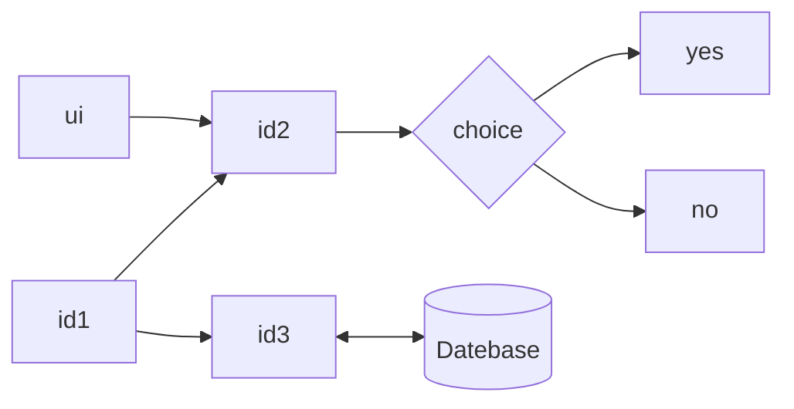

## Flowchart

```mermaid
    flowchart LR
    id1 --> id2
    id2 --> delta{choice}
    ui@{shape:manual-input, label:"user input"} -->id2
    delta --> yes
    delta --> no
    id1 --> id3
    id3 <--> db[(Datebase)]
```
