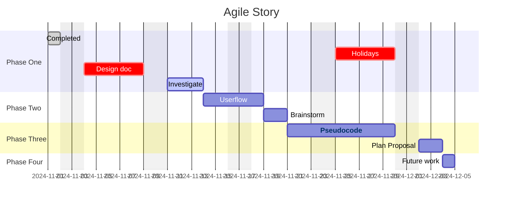

## Gantt

```mermaid
    gantt
        title Agile Story
        excludes weekends
        dateFormat %U
        %% active, crit, done

        Section Phase One
        Completed       : done, des1, 2024-11-01, 1d
        Holidays        : crit, holidays, 2024-11-25,5d
        Design doc      : crit, doc, after des1, 5d
        Investigate     : active, inv, after doc, 3d

        Section Phase Two
        Userflow        :       flow, after inv, 3d
        Brainstorm      :       br, after flow, 2d

        Section Phase Three
        Pseudocode      :       ps, after br, 1w
        Plan Proposal   :       prop, after ps, 2d

        Section Phase Four
        Future work     :       des3, after prop, 1d
        

        %% The below click does not seem to work
        click ps href "https://mermaid-js.github.io"
```
