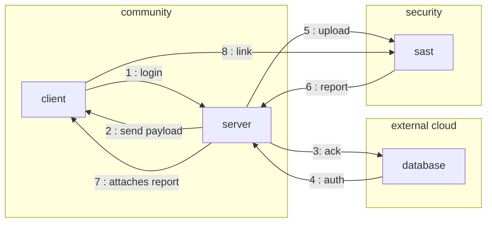

# Graph Example

```mermaid
graph LR
    subgraph community
        client -- 1 : login --> server
        server -- 2 : send payload --> client
    end
    subgraph external cloud
        server -- 3: ack --> database
        database -- 4 : auth --> server
        server -- 7 : attaches report --> client
    end
    subgraph security
        server -- 5 : upload --> sast
        sast -- 6 : report --> server
        client -- 8 : link --> sast
    end
```
