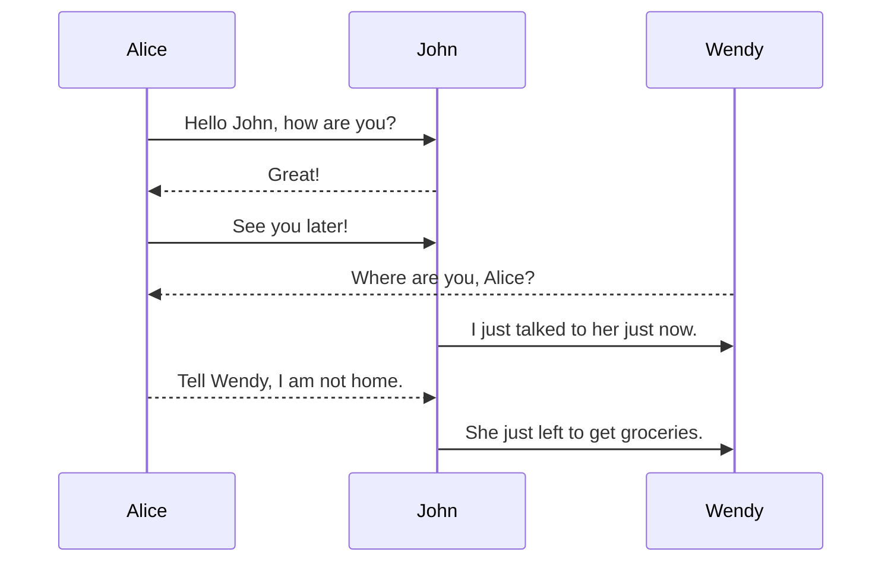

## Sequence

```mermaid
    sequenceDiagram
        Alice->>John: Hello John, how are you?
        John-->>Alice: Great!
        Alice->>John: See you later!
        Wendy-->>Alice: Where are you, Alice?
        John->>Wendy: I just talked to her just now.
        Alice-->>John: Tell Wendy, I am not home.
        John->>Wendy: She just left to get groceries.
```
